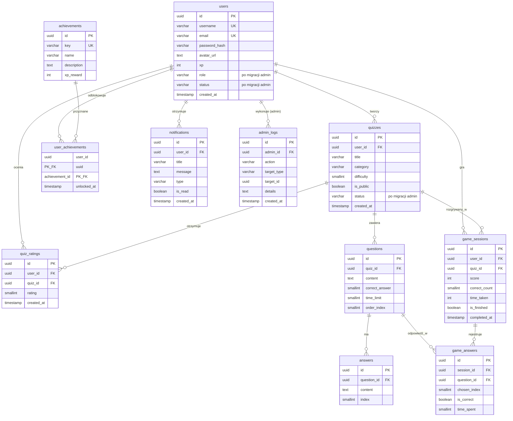

# QuizArena — diagram ERD

Diagram encji i relacji bazy danych PostgreSQL.

> Kolumny `users.role`, `users.status`, `quizzes.status` oraz tabela `admin_logs`
> pochodzą z `migrate_admin_system.php` (poza bazowym `schema.sql`).

## Diagram (Mermaid)



## Relacje tekstowo

```
users (1) ─────< quizzes                    tworzenie quizów
users (1) ─────< quiz_ratings               oceny 1–5 (UNIQUE user+quiz)
users (1) ─────< game_sessions              rozgrywki
users (1) ─────< user_achievements >──── (N) achievements
users (1) ─────< notifications
users (1) ─────< admin_logs                 audyt akcji admina

quizzes (1) ───< questions ───< answers     4 odpowiedzi na pytanie
quizzes (1) ───< game_sessions
quizzes (1) ───< quiz_ratings

game_sessions (1) ───< game_answers >── questions
                         UNIQUE (session_id, question_id)
```

## Kardynalność

| Relacja | Typ |
|---------|-----|
| users → quizzes | 1:N |
| users → user_achievements → achievements | N:M (PK złożony) |
| quizzes → questions → answers | 1:N → 1:N (4 odpowiedzi) |
| users + quizzes → game_sessions | N:1 + N:1 |
| game_sessions → game_answers | 1:N |

## Widoki SQL

Zdefiniowane w [`database/views.sql`](../database/views.sql):

| Widok | Opis |
|-------|------|
| `v_quiz_stats` | Statystyki quizów (pytania, gry, oceny) |
| `v_player_leaderboard` | Ranking graczy (XP, wynik, accuracy) |
| `v_session_summary` | Sesje gry z danymi użytkownika i quizu |
| `v_user_achievement_progress` | Osiągnięcia z flagą odblokowania |

### Instalacja widoków

```bash
# Windows PowerShell
Get-Content -Raw "database\views.sql" | docker compose exec -T db psql -U postgres -d quizarena

# Linux / macOS
cat database/views.sql | docker compose exec -T db psql -U postgres -d quizarena
```
